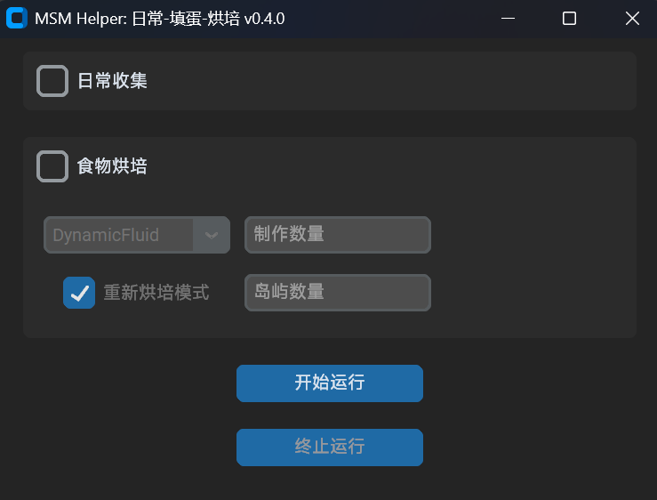

# 
 MSM Helper 

## 介绍
这是一个自动化脚本，用于执行游戏 `My Singing Monsters` `(萌怪合唱团)` 中的重复性操作。

## 功能

### 已有功能
- 自动采集大部分岛屿的金币、钻石、食物。
岛屿包括：
`
Plant Island, Cold Island, Air Island, Water Island, Fire Island, Shugabush Island, Ethereal Island, Ethereal Workshop, Fire Haven, Fire Oasis, Mythical Island, Light Island, Psychic Island, Faerie Island, Bone Island, Magical Sanctum, Wublin Island, Celestial Island
`

剩余的可收集岛屿
`
Magical Nexus, Paironormal Carnival, Amber Island
`
收集频次过低或过于特殊，因此未写入日常收集模块中。

- 自定义烘培食物
单个烘培模式：选择需要烘培的食物种类并输入烘培个数，遍历岛屿并在指定个数内的空烤箱中烘培对应食物
一键重新烘培模式：输入需要一键重新烘培的岛屿数量，为对应数量岛屿上的空烤箱执行重新烘培上一次烘培的食物

### 将实现的功能
- 培育器刷取
- 天体怪兽/wublin怪兽的自动培育、填蛋

### 计划中的功能

- 游玩记忆小游戏

## 运行说明
下载Releases中的发行压缩包并解压，运行其中的exe文件即可执行。

在开始执行程序前，请确保游戏已经开启并处于界面最上层。同时，需要确保当前正处于任何一个岛屿的主界面上（而非商店界面、选岛界面、培育烘焙界面等），主界面未被签到、部落岛奖励等信息覆盖（游戏内弹窗广告除外，脚本可以自动关闭）。

当脚本运行结束后，在exe文件的同目录下会生成gameLog.txt，其中会记载日志信息。若软件执行时崩溃或行为异常，请在反馈时附上日志文件。

**注意：若脚本执行情况异常且抢鼠标无法返回脚本界面，请将鼠标拖动到屏幕最左上角并保持一秒，程序将自动崩溃并退出。**

脚本功能基于图像识别实现。在烘培功能中，当烤箱被前置物品遮挡时，容易出现无法识别的情况。因此在执行单个烘培功能时，请确保所有空烤箱未被遮挡。同样地，对于一键重新烘培功能，请确保至少有一个空烤箱未被遮挡。

## 其他说明
欢迎 `My Singing Monsters` 的游戏同好共同参与开发。如有更多相关事宜咨询，请联系`shengjiangheyan@qq.com`。

请勿将本项目用于商业用途。作者不对因使用本脚本导致的任何游戏账号处罚、数据丢失或法律纠纷负责。若版权方认为本项目内容涉嫌侵权行为，请联系 `shengjiangheyan@qq.com` 删除。